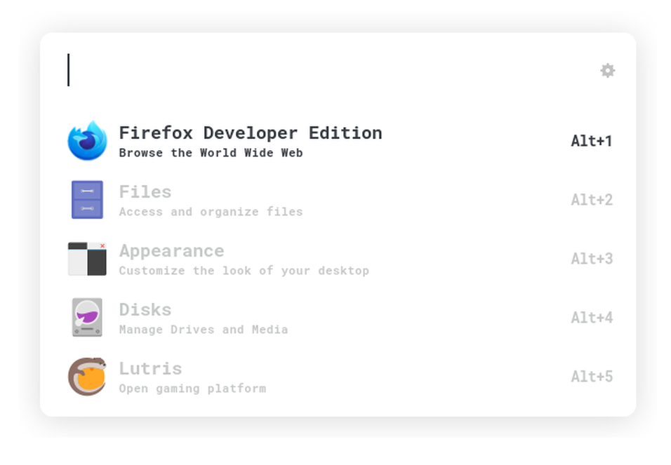

Install with: `curl https://raw.githubusercontent.com/0neGuyDev/ulauncher-whiteout/main/install.sh | sh`

Or manually place the files in your ulauncher user-themes folder.

This theme is a collection and part of my overall setup. You can check out other parts of the theme [here](https://github.com/0neGuyDev/whiteout)
